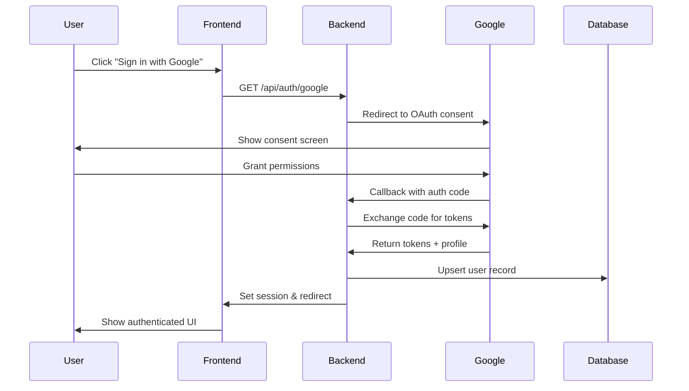
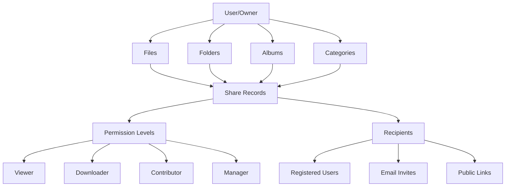

# MediaVault OAuth & File Sharing Architecture

## Executive Summary

This document outlines the comprehensive architecture for integrating Google OAuth authentication and implementing file sharing/collaboration features in the MediaVault application. The design maintains backward compatibility with existing Replit Auth while enabling granular file sharing, collaborative galleries, and secure access control.

## Part 1: Google OAuth Integration

### 1.1 Current Authentication State

**Existing System:**
- Replit Auth with OpenID Connect (OIDC)
- Development mode with hardcoded credentials
- Session-based authentication using PostgreSQL store
- User data stored in `users` table with basic profile fields

### 1.2 Google OAuth Architecture

#### 1.2.1 Authentication Flow



#### 1.2.2 Implementation Plan

**Phase 1: OAuth Setup**

1. **Install Dependencies:**
```bash
npm install passport-google-oauth20 @googleapis/oauth2 jsonwebtoken
```

2. **Environment Variables:**
```env
# Google OAuth
GOOGLE_CLIENT_ID=your-client-id
GOOGLE_CLIENT_SECRET=your-client-secret
GOOGLE_CALLBACK_URL=https://your-domain.com/api/auth/google/callback

# Auth mode selection
AUTH_MODE=multi  # Options: replit, google, multi
GOOGLE_OAUTH_ENABLED=true
```

3. **Database Schema Changes:**
```sql
-- Add Google OAuth fields to users table
ALTER TABLE users ADD COLUMN IF NOT EXISTS google_id VARCHAR(255) UNIQUE;
ALTER TABLE users ADD COLUMN IF NOT EXISTS auth_provider VARCHAR(50) DEFAULT 'replit';
ALTER TABLE users ADD COLUMN IF NOT EXISTS google_refresh_token TEXT;
ALTER TABLE users ADD COLUMN IF NOT EXISTS google_access_token TEXT;
ALTER TABLE users ADD COLUMN IF NOT EXISTS google_token_expires_at TIMESTAMP;

-- Create index for faster Google ID lookups
CREATE INDEX IF NOT EXISTS idx_users_google_id ON users(google_id);
CREATE INDEX IF NOT EXISTS idx_users_auth_provider ON users(auth_provider);

-- OAuth account linking table for multiple providers
CREATE TABLE IF NOT EXISTS oauth_accounts (
  id UUID PRIMARY KEY DEFAULT gen_random_uuid(),
  user_id VARCHAR(255) NOT NULL REFERENCES users(id) ON DELETE CASCADE,
  provider VARCHAR(50) NOT NULL,
  provider_account_id VARCHAR(255) NOT NULL,
  refresh_token TEXT,
  access_token TEXT,
  expires_at TIMESTAMP,
  token_type VARCHAR(50),
  scope TEXT,
  id_token TEXT,
  session_state TEXT,
  created_at TIMESTAMP DEFAULT NOW(),
  updated_at TIMESTAMP DEFAULT NOW(),
  UNIQUE(provider, provider_account_id)
);
```

4. **Google OAuth Strategy Implementation:**

```typescript
// server/auth/googleStrategy.ts
import { Strategy as GoogleStrategy } from 'passport-google-oauth20';
import { storage } from '../storage';

export function setupGoogleAuth(passport: any) {
  passport.use(new GoogleStrategy({
    clientID: process.env.GOOGLE_CLIENT_ID!,
    clientSecret: process.env.GOOGLE_CLIENT_SECRET!,
    callbackURL: process.env.GOOGLE_CALLBACK_URL!,
    scope: ['openid', 'email', 'profile']
  },
  async (accessToken, refreshToken, profile, done) => {
    try {
      // Check if user exists by Google ID
      let user = await storage.getUserByGoogleId(profile.id);

      if (!user) {
        // Check if email exists (for account linking)
        const existingUser = await storage.getUserByEmail(profile.emails?.[0]?.value);

        if (existingUser) {
          // Link accounts if email matches
          user = await storage.linkGoogleAccount(existingUser.id, {
            googleId: profile.id,
            googleAccessToken: accessToken,
            googleRefreshToken: refreshToken,
            authProvider: 'google'
          });
        } else {
          // Create new user
          user = await storage.upsertUser({
            id: `google_${profile.id}`,
            email: profile.emails?.[0]?.value,
            firstName: profile.name?.givenName,
            lastName: profile.name?.familyName,
            profileImageUrl: profile.photos?.[0]?.value,
            googleId: profile.id,
            authProvider: 'google',
            googleAccessToken: accessToken,
            googleRefreshToken: refreshToken
          });
        }
      } else {
        // Update tokens
        user = await storage.updateUserTokens(user.id, {
          googleAccessToken: accessToken,
          googleRefreshToken: refreshToken
        });
      }

      done(null, user);
    } catch (error) {
      done(error, null);
    }
  }));
}
```

5. **Multi-Provider Auth Router:**

```typescript
// server/auth/authRouter.ts
import { Router } from 'express';
import passport from 'passport';

export function createAuthRouter() {
  const router = Router();

  // Google OAuth routes
  router.get('/auth/google',
    passport.authenticate('google', {
      scope: ['openid', 'email', 'profile']
    })
  );

  router.get('/auth/google/callback',
    passport.authenticate('google', { failureRedirect: '/login' }),
    (req, res) => {
      res.redirect('/');
    }
  );

  // Existing Replit auth routes
  router.get('/auth/replit',
    passport.authenticate('replitauth', {
      scope: ['openid', 'email', 'profile']
    })
  );

  // Unified logout
  router.get('/logout', (req: any, res) => {
    const authProvider = req.user?.authProvider || 'replit';
    req.logout(() => {
      if (authProvider === 'google') {
        res.redirect('/');
      } else {
        // Replit logout flow
        res.redirect(buildReplitLogoutUrl(req));
      }
    });
  });

  return router;
}
```

#### 1.2.3 Security Considerations

1. **State Parameter**: Implement CSRF protection using state parameter
2. **Token Storage**: Encrypt refresh tokens in database
3. **Token Refresh**: Implement automatic token refresh middleware
4. **Scope Management**: Request minimal required scopes
5. **Account Linking**: Verify email ownership before linking accounts

#### 1.2.4 Migration Path

1. **Phase 1**: Add Google OAuth alongside Replit Auth
2. **Phase 2**: Migrate existing users (optional email verification)
3. **Phase 3**: Deprecate Replit Auth (configurable)

## Part 2: File Sharing & Collaboration Architecture

### 2.1 Sharing Model Overview



### 2.2 Database Schema for Sharing

```sql
-- Main shares table for all sharing operations
CREATE TABLE IF NOT EXISTS shares (
  id UUID PRIMARY KEY DEFAULT gen_random_uuid(),
  -- Resource being shared
  resource_type VARCHAR(50) NOT NULL, -- 'file', 'folder', 'album', 'category'
  resource_id UUID NOT NULL,
  -- Who is sharing
  owner_id VARCHAR(255) NOT NULL REFERENCES users(id) ON DELETE CASCADE,
  -- Share settings
  share_type VARCHAR(50) NOT NULL, -- 'user', 'email', 'link', 'public'
  permission_level VARCHAR(50) NOT NULL DEFAULT 'viewer', -- 'viewer', 'downloader', 'contributor', 'manager'
  -- Optional password protection
  password_hash VARCHAR(255),
  -- Expiration settings
  expires_at TIMESTAMP,
  max_views INTEGER,
  view_count INTEGER DEFAULT 0,
  -- Tracking
  last_accessed_at TIMESTAMP,
  created_at TIMESTAMP DEFAULT NOW(),
  updated_at TIMESTAMP DEFAULT NOW(),
  -- Ensure no duplicate shares for same resource/recipient
  CONSTRAINT unique_share_per_resource UNIQUE(resource_type, resource_id, share_type, recipient_id, recipient_email)
);

-- Recipients of shares (registered users)
CREATE TABLE IF NOT EXISTS share_recipients (
  id UUID PRIMARY KEY DEFAULT gen_random_uuid(),
  share_id UUID NOT NULL REFERENCES shares(id) ON DELETE CASCADE,
  recipient_id VARCHAR(255) REFERENCES users(id) ON DELETE CASCADE,
  recipient_email VARCHAR(255), -- For email invites to non-users
  -- Recipient-specific permissions (can override share defaults)
  permission_override VARCHAR(50),
  -- Acceptance tracking
  accepted_at TIMESTAMP,
  declined_at TIMESTAMP,
  -- Notifications
  notification_sent_at TIMESTAMP,
  reminder_sent_at TIMESTAMP,
  created_at TIMESTAMP DEFAULT NOW()
);

-- Shared galleries (collaborative albums)
CREATE TABLE IF NOT EXISTS shared_galleries (
  id UUID PRIMARY KEY DEFAULT gen_random_uuid(),
  name VARCHAR(255) NOT NULL,
  description TEXT,
  owner_id VARCHAR(255) NOT NULL REFERENCES users(id) ON DELETE CASCADE,
  -- Gallery settings
  allow_downloads BOOLEAN DEFAULT true,
  allow_contributions BOOLEAN DEFAULT false,
  require_approval BOOLEAN DEFAULT false, -- Approve contributions before showing
  max_contributors INTEGER,
  max_items INTEGER,
  -- Theming
  theme_color VARCHAR(7),
  cover_image_id UUID REFERENCES files(id),
  -- Stats
  total_items INTEGER DEFAULT 0,
  total_contributors INTEGER DEFAULT 0,
  total_views INTEGER DEFAULT 0,
  -- Timestamps
  created_at TIMESTAMP DEFAULT NOW(),
  updated_at TIMESTAMP DEFAULT NOW()
);

-- Items in shared galleries
CREATE TABLE IF NOT EXISTS shared_gallery_items (
  id UUID PRIMARY KEY DEFAULT gen_random_uuid(),
  gallery_id UUID NOT NULL REFERENCES shared_galleries(id) ON DELETE CASCADE,
  file_id UUID NOT NULL REFERENCES files(id) ON DELETE CASCADE,
  -- Contribution tracking
  added_by VARCHAR(255) NOT NULL REFERENCES users(id),
  approved_by VARCHAR(255) REFERENCES users(id),
  approved_at TIMESTAMP,
  -- Item metadata
  caption TEXT,
  sort_order INTEGER DEFAULT 0,
  is_featured BOOLEAN DEFAULT false,
  -- Stats
  view_count INTEGER DEFAULT 0,
  download_count INTEGER DEFAULT 0,
  -- Timestamps
  added_at TIMESTAMP DEFAULT NOW()
);

-- Gallery contributors with specific permissions
CREATE TABLE IF NOT EXISTS shared_gallery_contributors (
  id UUID PRIMARY KEY DEFAULT gen_random_uuid(),
  gallery_id UUID NOT NULL REFERENCES shared_galleries(id) ON DELETE CASCADE,
  user_id VARCHAR(255) NOT NULL REFERENCES users(id) ON DELETE CASCADE,
  -- Permissions
  can_add BOOLEAN DEFAULT true,
  can_remove BOOLEAN DEFAULT false,
  can_edit BOOLEAN DEFAULT false,
  can_invite BOOLEAN DEFAULT false,
  can_manage BOOLEAN DEFAULT false,
  -- Contribution stats
  items_added INTEGER DEFAULT 0,
  -- Status
  invited_by VARCHAR(255) REFERENCES users(id),
  invited_at TIMESTAMP DEFAULT NOW(),
  joined_at TIMESTAMP,
  left_at TIMESTAMP,
  UNIQUE(gallery_id, user_id)
);

-- Share access logs for audit trail
CREATE TABLE IF NOT EXISTS share_access_logs (
  id UUID PRIMARY KEY DEFAULT gen_random_uuid(),
  share_id UUID REFERENCES shares(id) ON DELETE CASCADE,
  gallery_id UUID REFERENCES shared_galleries(id) ON DELETE CASCADE,
  -- Who accessed
  user_id VARCHAR(255) REFERENCES users(id),
  anonymous_id VARCHAR(255), -- For public/link shares
  ip_address VARCHAR(45),
  user_agent TEXT,
  -- What was accessed
  action VARCHAR(50) NOT NULL, -- 'view', 'download', 'upload', 'edit', 'delete'
  resource_type VARCHAR(50),
  resource_id UUID,
  -- Result
  success BOOLEAN DEFAULT true,
  error_message TEXT,
  -- Timestamp
  accessed_at TIMESTAMP DEFAULT NOW()
);

-- Indexes for performance
CREATE INDEX IF NOT EXISTS idx_shares_owner ON shares(owner_id);
CREATE INDEX IF NOT EXISTS idx_shares_resource ON shares(resource_type, resource_id);
CREATE INDEX IF NOT EXISTS idx_shares_expires ON shares(expires_at);
CREATE INDEX IF NOT EXISTS idx_share_recipients_share ON share_recipients(share_id);
CREATE INDEX IF NOT EXISTS idx_share_recipients_user ON share_recipients(recipient_id);
CREATE INDEX IF NOT EXISTS idx_shared_galleries_owner ON shared_galleries(owner_id);
CREATE INDEX IF NOT EXISTS idx_shared_gallery_items_gallery ON shared_gallery_items(gallery_id);
CREATE INDEX IF NOT EXISTS idx_shared_gallery_contributors_gallery ON shared_gallery_contributors(gallery_id);
CREATE INDEX IF NOT EXISTS idx_shared_gallery_contributors_user ON shared_gallery_contributors(user_id);
CREATE INDEX IF NOT EXISTS idx_share_access_logs_share ON share_access_logs(share_id);
CREATE INDEX IF NOT EXISTS idx_share_access_logs_user ON share_access_logs(user_id);
```

### 2.3 API Endpoints Specification

#### 2.3.1 Sharing APIs

```typescript
// Share Management
POST   /api/shares                    // Create new share
GET    /api/shares                    // List user's shares (created & received)
GET    /api/shares/:id                // Get share details
PATCH  /api/shares/:id                // Update share settings
DELETE /api/shares/:id                // Revoke share

// Share Recipients
POST   /api/shares/:id/recipients     // Add recipients to share
DELETE /api/shares/:id/recipients/:recipientId  // Remove recipient
PATCH  /api/shares/:id/recipients/:recipientId  // Update recipient permissions

// Share Access
GET    /api/shared/:shareId           // Access shared content (with optional password)
POST   /api/shared/:shareId/accept    // Accept share invitation
POST   /api/shared/:shareId/decline   // Decline share invitation

// Shared Galleries
POST   /api/galleries                 // Create shared gallery
GET    /api/galleries                 // List user's galleries
GET    /api/galleries/:id             // Get gallery details
PATCH  /api/galleries/:id             // Update gallery settings
DELETE /api/galleries/:id             // Delete gallery

// Gallery Items
POST   /api/galleries/:id/items       // Add items to gallery
GET    /api/galleries/:id/items       // List gallery items
DELETE /api/galleries/:id/items/:itemId  // Remove item from gallery
PATCH  /api/galleries/:id/items/:itemId  // Update item metadata

// Gallery Contributors
POST   /api/galleries/:id/contributors    // Invite contributors
GET    /api/galleries/:id/contributors    // List contributors
PATCH  /api/galleries/:id/contributors/:userId  // Update contributor permissions
DELETE /api/galleries/:id/contributors/:userId  // Remove contributor

// Public Access
GET    /api/public/share/:shareCode   // Access public share (no auth required)
GET    /api/public/gallery/:galleryId // Access public gallery (no auth required)
```

#### 2.3.2 OpenAPI Specification Example

```yaml
openapi: 3.0.0
info:
  title: MediaVault Sharing API
  version: 1.0.0

paths:
  /api/shares:
    post:
      summary: Create a new share
      security:
        - bearerAuth: []
      requestBody:
        required: true
        content:
          application/json:
            schema:
              type: object
              required:
                - resourceType
                - resourceId
                - shareType
                - permissionLevel
              properties:
                resourceType:
                  type: string
                  enum: [file, folder, album, category]
                resourceId:
                  type: string
                  format: uuid
                shareType:
                  type: string
                  enum: [user, email, link, public]
                permissionLevel:
                  type: string
                  enum: [viewer, downloader, contributor, manager]
                recipients:
                  type: array
                  items:
                    type: object
                    properties:
                      userId:
                        type: string
                      email:
                        type: string
                password:
                  type: string
                expiresAt:
                  type: string
                  format: date-time
                maxViews:
                  type: integer
      responses:
        201:
          description: Share created successfully
          content:
            application/json:
              schema:
                $ref: '#/components/schemas/Share'
        403:
          description: Forbidden - user doesn't own the resource
        404:
          description: Resource not found
```

### 2.4 Permission Checking Logic

```typescript
// server/middleware/sharePermissions.ts
export class SharePermissionChecker {
  async checkAccess(
    userId: string | null,
    resourceType: string,
    resourceId: string,
    requiredPermission: 'view' | 'download' | 'contribute' | 'manage'
  ): Promise<boolean> {
    // 1. Check if user owns the resource
    const isOwner = await this.checkOwnership(userId, resourceType, resourceId);
    if (isOwner) return true;

    // 2. Check direct shares
    const directShare = await this.checkDirectShare(userId, resourceType, resourceId);
    if (directShare && this.hasPermission(directShare.permissionLevel, requiredPermission)) {
      return true;
    }

    // 3. Check inherited shares (parent folders/categories)
    const inheritedShare = await this.checkInheritedShare(userId, resourceType, resourceId);
    if (inheritedShare && this.hasPermission(inheritedShare.permissionLevel, requiredPermission)) {
      return true;
    }

    // 4. Check gallery membership
    const galleryAccess = await this.checkGalleryAccess(userId, resourceType, resourceId);
    if (galleryAccess && this.hasPermission(galleryAccess.permissionLevel, requiredPermission)) {
      return true;
    }

    // 5. Check public/link shares
    const publicAccess = await this.checkPublicAccess(resourceType, resourceId);
    if (publicAccess && this.hasPermission(publicAccess.permissionLevel, requiredPermission)) {
      return true;
    }

    return false;
  }

  private hasPermission(userLevel: string, requiredLevel: string): boolean {
    const levels = {
      'viewer': 1,
      'downloader': 2,
      'contributor': 3,
      'manager': 4
    };

    return levels[userLevel] >= levels[requiredLevel];
  }

  private async checkOwnership(
    userId: string | null,
    resourceType: string,
    resourceId: string
  ): Promise<boolean> {
    if (!userId) return false;

    switch (resourceType) {
      case 'file':
        const file = await storage.getFile(resourceId);
        return file?.userId === userId;
      case 'folder':
        const folder = await storage.getFolder(resourceId);
        return folder?.userId === userId;
      case 'album':
        const album = await storage.getAlbum(resourceId);
        return album?.userId === userId;
      case 'category':
        // Categories might not have owners in current schema
        return false;
      default:
        return false;
    }
  }

  // Additional helper methods...
}
```

### 2.5 Vault Content Sharing

#### 2.5.1 Challenge: Sharing Encrypted Content

**Problem**: Vault-encrypted content requires a passphrase that the owner may not want to share.

**Solutions**:

1. **Separate Share Passphrase**:
```typescript
// Generate a unique passphrase for shared encrypted content
async function shareEncryptedFile(fileId: string, sharePassphrase: string) {
  const file = await storage.getFile(fileId);
  if (!file.isEncrypted) throw new Error('File is not encrypted');

  // Re-encrypt with share passphrase
  const originalData = await cryptoService.decrypt(file.binaryData, file.encryptionKey);
  const shareKey = await cryptoService.deriveKey(sharePassphrase);
  const reencryptedData = await cryptoService.encrypt(originalData, shareKey);

  // Store share-specific encryption data
  await storage.createShareEncryption({
    shareId,
    fileId,
    shareEncryptionKey: shareKey,
    shareEncryptedData: reencryptedData
  });
}
```

2. **Wrapped Key Approach**:
```typescript
// Wrap the file's encryption key with a share-specific key
async function createWrappedKeyShare(fileId: string, recipientPublicKey: string) {
  const file = await storage.getFile(fileId);

  // Wrap the file's encryption key with recipient's public key
  const wrappedKey = await cryptoService.wrapKey(
    file.encryptionKey,
    recipientPublicKey
  );

  // Store wrapped key in share record
  await storage.createShare({
    fileId,
    wrappedKey,
    recipientPublicKey
  });
}
```

3. **Proxy Decryption Service**:
```typescript
// Server-side decryption for shared vault content
app.get('/api/shared/vault/:shareId/decrypt', async (req, res) => {
  const share = await validateShareAccess(req.params.shareId);

  // Decrypt on server with owner's vault key (stored securely)
  const decryptedStream = await vaultService.getDecryptedStream(
    share.fileId,
    share.ownerId
  );

  // Stream decrypted content to authorized recipient
  decryptedStream.pipe(res);
});
```

### 2.6 UI/UX Design Considerations

#### 2.6.1 Share Button Placement
- Contextual menu on file/folder right-click
- Action bar when items selected
- File details panel
- Hover overlay on thumbnails

#### 2.6.2 Share Modal Design
```
┌─────────────────────────────────┐
│ Share "Vacation Photos"          │
├─────────────────────────────────┤
│ Share with:                      │
│ ┌─────────────────────────────┐ │
│ │ Email or name...            │ │
│ └─────────────────────────────┘ │
│                                  │
│ Permission:                      │
│ [Viewer ▼] [Can download □]     │
│                                  │
│ Advanced:                        │
│ • Set expiration date           │
│ • Require password              │
│ • Limit downloads               │
│                                  │
│ [Copy Link] [Share]             │
└─────────────────────────────┘
```

#### 2.6.3 Shared Galleries Page
```
┌────────────────────────────────────┐
│ Shared Galleries                   │
├────────────────────────────────────┤
│ [+ New Gallery]                    │
│                                     │
│ ┌──────────┐ ┌──────────┐         │
│ │ Family   │ │ Work     │         │
│ │ Album    │ │ Projects │         │
│ │ 45 items │ │ 12 items │         │
│ │ 3 people │ │ 5 people │         │
│ └──────────┘ └──────────┘         │
│                                     │
│ Shared with me:                    │
│ ┌──────────┐ ┌──────────┐         │
│ │ Team     │ │ Friends  │         │
│ │ Photos   │ │ Videos   │         │
│ │ 23 items │ │ 8 items  │         │
│ └──────────┘ └──────────┘         │
└────────────────────────────────────┘
```

### 2.7 Security Model

#### 2.7.1 Access Control Matrix

| Permission Level | View | Download | Upload | Edit | Delete | Share | Manage |
|-----------------|------|----------|---------|------|--------|-------|--------|
| Viewer          | ✓    | ✗        | ✗       | ✗    | ✗      | ✗     | ✗      |
| Downloader      | ✓    | ✓        | ✗       | ✗    | ✗      | ✗     | ✗      |
| Contributor     | ✓    | ✓        | ✓       | ✗    | ✗      | ✗     | ✗      |
| Manager         | ✓    | ✓        | ✓       | ✓    | ✓      | ✓     | ✓      |

#### 2.7.2 Security Controls

1. **Rate Limiting**:
```typescript
const shareLimiter = rateLimit({
  windowMs: 15 * 60 * 1000, // 15 minutes
  max: 100, // Limit each IP to 100 requests per window
  message: 'Too many share requests, please try again later'
});

app.use('/api/shares', shareLimiter);
```

2. **Input Validation**:
```typescript
const createShareSchema = z.object({
  resourceType: z.enum(['file', 'folder', 'album', 'category']),
  resourceId: z.string().uuid(),
  recipients: z.array(z.union([
    z.object({ userId: z.string() }),
    z.object({ email: z.string().email() })
  ])).max(100), // Limit recipients
  permissionLevel: z.enum(['viewer', 'downloader', 'contributor', 'manager']),
  expiresAt: z.string().datetime().optional(),
  password: z.string().min(8).optional()
});
```

3. **Audit Logging**:
```typescript
async function logShareAccess(
  shareId: string,
  userId: string | null,
  action: string,
  success: boolean,
  req: Request
) {
  await storage.createShareAccessLog({
    shareId,
    userId,
    anonymousId: userId ? null : generateAnonymousId(req),
    ipAddress: req.ip,
    userAgent: req.get('user-agent'),
    action,
    success,
    accessedAt: new Date()
  });
}
```

## Part 3: Implementation Phases

### Phase 1: MVP Features (2-3 weeks)

**Week 1: OAuth Integration**
- [ ] Set up Google OAuth credentials
- [ ] Implement passport-google-oauth20
- [ ] Add database migrations for OAuth fields
- [ ] Create account linking flow
- [ ] Test authentication flow

**Week 2: Basic Sharing**
- [ ] Create shares database tables
- [ ] Implement share creation API
- [ ] Add permission checking middleware
- [ ] Create share access endpoints
- [ ] Build basic share UI

**Week 3: Testing & Polish**
- [ ] Write E2E tests for auth flow
- [ ] Test share permissions
- [ ] Fix edge cases
- [ ] Update documentation

### Phase 2: Enhanced Features (2-3 weeks)

**Week 4: Shared Galleries**
- [ ] Implement gallery database schema
- [ ] Create gallery management APIs
- [ ] Build gallery UI components
- [ ] Add contributor management

**Week 5: Advanced Sharing**
- [ ] Add email invitations
- [ ] Implement public link generation
- [ ] Add password protection
- [ ] Create expiration handling

**Week 6: Vault Sharing**
- [ ] Design encrypted content sharing
- [ ] Implement wrapped key approach
- [ ] Test security model
- [ ] Add UI for vault sharing

### Phase 3: Advanced Collaboration (2-3 weeks)

**Week 7: Real-time Updates**
- [ ] Add WebSocket support
- [ ] Implement live gallery updates
- [ ] Create presence indicators
- [ ] Add activity feeds

**Week 8: Enhanced Permissions**
- [ ] Implement folder inheritance
- [ ] Add batch operations
- [ ] Create permission templates
- [ ] Build admin controls

**Week 9: Performance & Scale**
- [ ] Add caching layer
- [ ] Optimize permission queries
- [ ] Implement CDN for shared content
- [ ] Load testing

## Part 4: Edge Cases & Challenges

### 4.1 Sharing Encrypted Vault Content

**Challenge**: Owner's vault passphrase cannot be shared directly.

**Solution Options**:

1. **Re-encryption Approach**:
   - Pro: Complete security isolation
   - Con: Storage overhead, processing time

2. **Proxy Decryption**:
   - Pro: No storage overhead
   - Con: Server load, requires online owner

3. **Key Escrow**:
   - Pro: Offline sharing possible
   - Con: Security complexity, key management

**Recommendation**: Implement re-encryption for MVP, consider proxy for Phase 2.

### 4.2 Quota Management

**Challenge**: Shared content affects storage quotas.

**Solutions**:
```typescript
// Option 1: Count against owner's quota only
async function checkOwnerQuota(ownerId: string, fileSize: number) {
  const user = await storage.getUser(ownerId);
  return (user.storageUsed + fileSize) <= user.storageQuota;
}

// Option 2: Count against recipient's quota for copies
async function duplicateForRecipient(fileId: string, recipientId: string) {
  const file = await storage.getFile(fileId);
  const recipient = await storage.getUser(recipientId);

  if ((recipient.storageUsed + file.fileSize) > recipient.storageQuota) {
    throw new Error('Recipient quota exceeded');
  }

  // Create copy owned by recipient
  return await storage.copyFile(fileId, recipientId);
}

// Option 3: Shared quota pools for galleries
async function checkGalleryQuota(galleryId: string, fileSize: number) {
  const gallery = await storage.getGallery(galleryId);
  return (gallery.storageUsed + fileSize) <= gallery.maxStorage;
}
```

### 4.3 Orphaned Shares Cleanup

**Challenge**: Shares pointing to deleted resources.

**Solution**:
```typescript
// Scheduled job to clean orphaned shares
async function cleanupOrphanedShares() {
  // Find shares with non-existent resources
  const orphanedShares = await db.execute(sql`
    SELECT s.* FROM shares s
    LEFT JOIN files f ON s.resource_type = 'file' AND s.resource_id = f.id
    LEFT JOIN folders fo ON s.resource_type = 'folder' AND s.resource_id = fo.id
    LEFT JOIN albums a ON s.resource_type = 'album' AND s.resource_id = a.id
    WHERE s.resource_type IN ('file', 'folder', 'album')
    AND f.id IS NULL
    AND fo.id IS NULL
    AND a.id IS NULL
  `);

  // Delete orphaned shares
  for (const share of orphanedShares) {
    await storage.deleteShare(share.id);
    await logCleanup('orphaned_share', share.id);
  }
}

// Run cleanup daily
schedule.scheduleJob('0 0 * * *', cleanupOrphanedShares);
```

### 4.4 Performance at Scale

**Challenge**: Permission checks on large datasets.

**Solutions**:

1. **Materialized Permission Views**:
```sql
CREATE MATERIALIZED VIEW user_accessible_files AS
SELECT DISTINCT
  f.id as file_id,
  u.id as user_id,
  GREATEST(
    CASE WHEN f.user_id = u.id THEN 4 ELSE 0 END,
    COALESCE(MAX(CASE
      WHEN s.permission_level = 'manager' THEN 4
      WHEN s.permission_level = 'contributor' THEN 3
      WHEN s.permission_level = 'downloader' THEN 2
      WHEN s.permission_level = 'viewer' THEN 1
      ELSE 0
    END), 0)
  ) as permission_level
FROM files f
CROSS JOIN users u
LEFT JOIN shares s ON s.resource_id = f.id
  AND s.resource_type = 'file'
LEFT JOIN share_recipients sr ON sr.share_id = s.id
  AND sr.recipient_id = u.id
GROUP BY f.id, u.id;

CREATE INDEX idx_user_accessible_files ON user_accessible_files(user_id, file_id);
```

2. **Redis Permission Cache**:
```typescript
class PermissionCache {
  private redis: Redis;

  async getPermission(userId: string, resourceId: string): Promise<number | null> {
    const key = `perm:${userId}:${resourceId}`;
    const cached = await this.redis.get(key);
    return cached ? parseInt(cached) : null;
  }

  async setPermission(userId: string, resourceId: string, level: number) {
    const key = `perm:${userId}:${resourceId}`;
    await this.redis.setex(key, 300, level); // 5 minute TTL
  }

  async invalidateUser(userId: string) {
    const keys = await this.redis.keys(`perm:${userId}:*`);
    if (keys.length > 0) {
      await this.redis.del(...keys);
    }
  }
}
```

3. **Batch Permission Checking**:
```typescript
async function checkBulkPermissions(
  userId: string,
  resourceIds: string[],
  requiredLevel: string
): Promise<Map<string, boolean>> {
  // Single query for all resources
  const permissions = await db.execute(sql`
    SELECT
      resource_id,
      MAX(permission_level) as max_level
    FROM (
      -- Owner permissions
      SELECT id as resource_id, 4 as permission_level
      FROM files WHERE user_id = ${userId} AND id = ANY(${resourceIds})

      UNION ALL

      -- Shared permissions
      SELECT s.resource_id,
        CASE s.permission_level
          WHEN 'manager' THEN 4
          WHEN 'contributor' THEN 3
          WHEN 'downloader' THEN 2
          WHEN 'viewer' THEN 1
        END as permission_level
      FROM shares s
      JOIN share_recipients sr ON sr.share_id = s.id
      WHERE sr.recipient_id = ${userId}
        AND s.resource_id = ANY(${resourceIds})
        AND (s.expires_at IS NULL OR s.expires_at > NOW())
    ) AS combined
    GROUP BY resource_id
  `);

  // Convert to map
  const permMap = new Map<string, boolean>();
  const requiredLevelNum = getPermissionLevel(requiredLevel);

  for (const perm of permissions) {
    permMap.set(
      perm.resource_id,
      perm.max_level >= requiredLevelNum
    );
  }

  // Mark missing resources as no permission
  for (const id of resourceIds) {
    if (!permMap.has(id)) {
      permMap.set(id, false);
    }
  }

  return permMap;
}
```

## Part 5: Monitoring & Analytics

### 5.1 Metrics to Track

```typescript
// Share metrics
interface ShareMetrics {
  totalShares: number;
  activeShares: number;
  expiredShares: number;
  sharesByType: Record<string, number>;
  sharesByPermission: Record<string, number>;
  averageRecipientsPerShare: number;
  mostSharedFiles: Array<{ fileId: string; shareCount: number }>;
}

// Gallery metrics
interface GalleryMetrics {
  totalGalleries: number;
  activeContributors: number;
  totalGalleryItems: number;
  averageItemsPerGallery: number;
  mostActiveGalleries: Array<{ galleryId: string; activity: number }>;
}

// Usage metrics
interface UsageMetrics {
  shareAccessCount: number;
  uniqueShareViewers: number;
  downloadCount: number;
  uploadToGalleryCount: number;
  averageShareLifespan: number;
}
```

### 5.2 Monitoring Dashboard

```sql
-- Share usage dashboard query
CREATE VIEW share_analytics AS
SELECT
  DATE(created_at) as date,
  COUNT(*) as shares_created,
  COUNT(DISTINCT owner_id) as unique_sharers,
  COUNT(DISTINCT sr.recipient_id) as unique_recipients,
  AVG(EXTRACT(EPOCH FROM (expires_at - created_at))) as avg_share_duration_seconds,
  SUM(view_count) as total_views
FROM shares s
LEFT JOIN share_recipients sr ON sr.share_id = s.id
GROUP BY DATE(created_at);
```

## Conclusion

This architecture provides a robust foundation for OAuth integration and comprehensive file sharing in MediaVault. The phased approach allows for iterative development while maintaining system stability. Key considerations include security (encryption, permissions), scalability (caching, batch operations), and user experience (intuitive UI, real-time updates).

### Next Steps

1. Review and approve architecture
2. Set up Google Cloud Console for OAuth
3. Create database migration scripts
4. Begin Phase 1 implementation
5. Prepare test plans for each phase

### Estimated Timeline

- **Phase 1**: 2-3 weeks
- **Phase 2**: 2-3 weeks
- **Phase 3**: 2-3 weeks
- **Total**: 6-9 weeks for full implementation

### Risk Mitigation

1. **Security Risks**: Regular security audits, penetration testing
2. **Performance Risks**: Load testing, caching strategies
3. **Data Loss Risks**: Backup strategies, soft deletes
4. **User Adoption**: Gradual rollout, user training materials